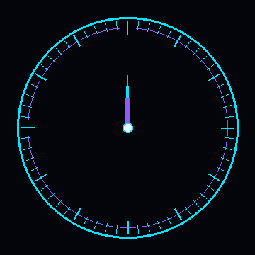

 

  

---

## ⏱️ SKILL CLOCK

  

**HTML · CSS · JavaScript · React · Node.js · Java · C · SQL · PostgreSQL**

---

## ⚡ MISSION CONTROL

| SYSTEM | STATUS |
|:---|:---|
| 🎓 Education | **B.Tech CSE** |
| 🟢 Current Mission | **G.R.I.L. Training @ NVIDIA** |
| 💻 Main Focus | **Web Development** |
| 🧠 Problem Solving | **DSA & Programming** |
| ⚙️ Backend | **Node.js** |
| 🗄️ Database | **SQL · PostgreSQL** |
| ☕ Languages | **Java · C Basics** |
| 🚀 Mode | **LEARNING / BUILDING** |

---

## 🧩 TECH STACK

### LANGUAGES

  

### FRONTEND + BACKEND

  

### DATABASE

  

### TOOLS

---

## 🌐 DEVELOPMENT FOCUS

 

---

## 🧠 DEVELOPER JOURNEY

### `LEARN`

⬇️

### `EXPERIMENT`

⬇️

### `BUILD`

⬇️

### `DEBUG`

⬇️

### `IMPROVE`

⬇️

### `REPEAT`

---

## 🛰️ CURRENT FOCUS

 

**WEB DEVELOPMENT**

`HTML` · `CSS` · `JavaScript` · `React`

  

**BACKEND**

`Node.js`

  

**PROGRAMMING**

`Java` · `C Basics` · `DSA`

  

**DATABASE**

`SQL` · `PostgreSQL`

  

**PROFESSIONAL GROWTH**

`G.R.I.L. Training @ NVIDIA`

---

## 📊 GITHUB ACTIVITY

---

## 🔮 CURRENTLY LEARNING

---

## ✦ DEVELOPER MINDSET

### `CURIOSITY → CODE → DEBUG → GROWTH`

 

> **Don't just learn technology. Build with it.**

---

## 🔗 CONNECT

  

`✦ LEARNING • BUILDING • EVOLVING ✦`

---

