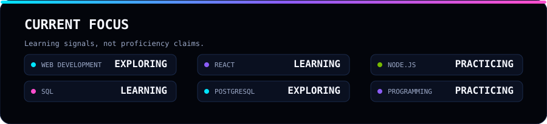
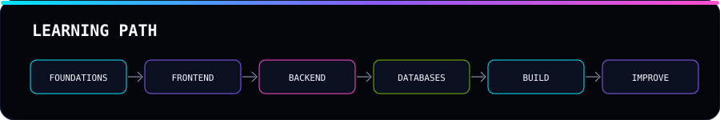

# TANU TOMAR

`B.Tech Computer Science & Engineering`  ·  `G.R.I.L. Training @ NVIDIA`

**Web Development · React · Node.js · SQL**

 

## DEVELOPER ORBIT

## DEVELOPER PROFILE

I am Tanu Tomar, a B.Tech Computer Science & Engineering student currently undergoing G.R.I.L. Training at NVIDIA. I am interested in web development and exploring frontend, backend, databases, programming, and continuous learning.

## CURRENT MISSION

## TECHNOLOGY UNIVERSE

## CURRENT FOCUS

## LEARNING PATH

## GITHUB TELEMETRY

## CONTRIBUTION UNIVERSE

## GITHUB ACTIVITY

## DEVELOPER MINDSET

> Learn with curiosity. Build with care. Debug with patience. Keep improving.

## GITHUB / CONNECT

