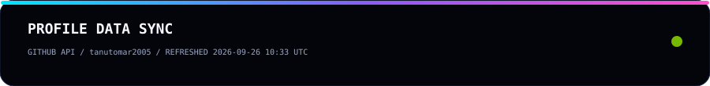
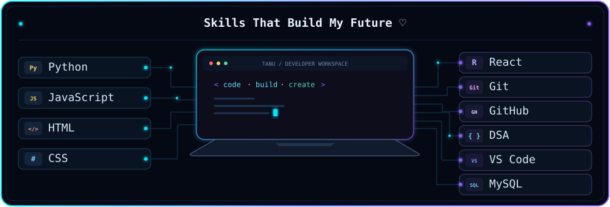
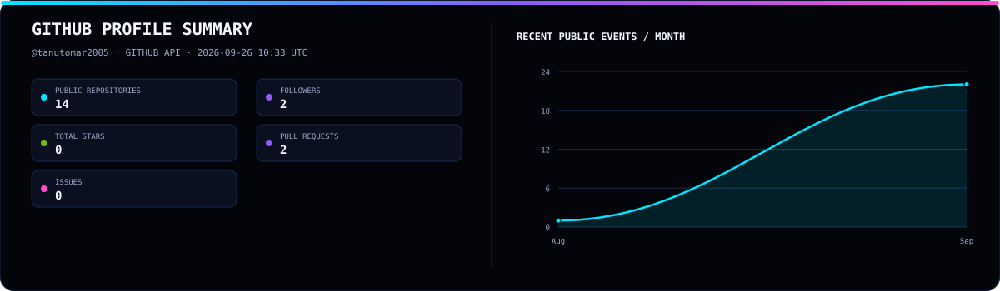
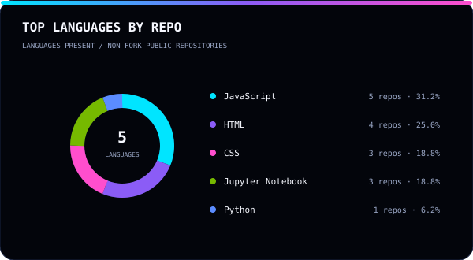
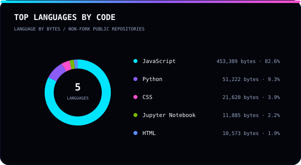
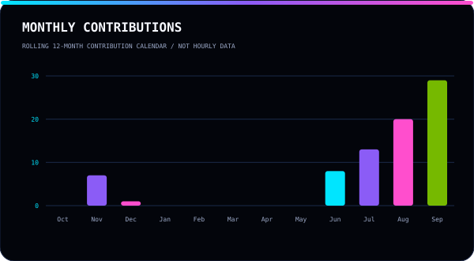
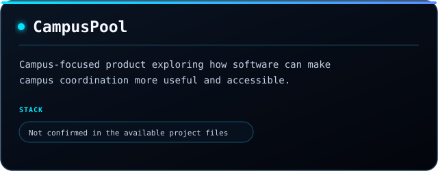
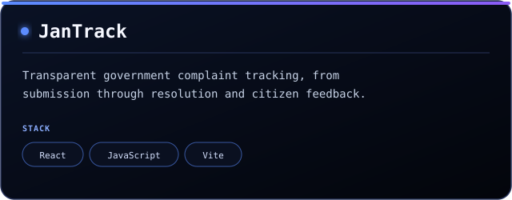
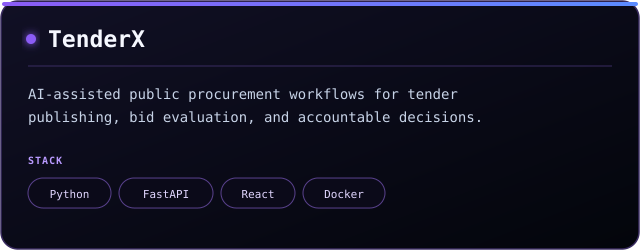
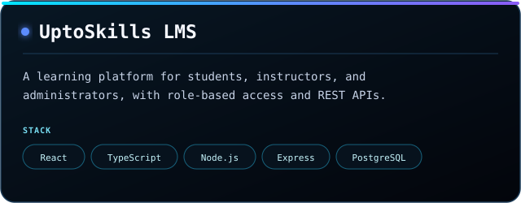

# Hi, I'm Tanu Tomar

### Full Stack Developer · B.Tech CSE Student · Problem Solver

Building practical software, strengthening fundamentals, and learning one commit at a time.

**Building:** full-stack products · **Learning:** DSA, REST APIs, Docker &amp; deployment

`Python` · `JavaScript` · `React.js` · `REST APIs` · `Docker`

<a href="https://github.com/tanutomar2005">GitHub</a> · <a href="https://github.com/tanutomar2005?tab=repositories">Repositories</a>

## ⚡ GITHUB PULSE

GitHub API snapshot for <a href="https://github.com/tanutomar2005">@tanutomar2005</a> · refreshes every six hours
 

## 💻 MY SKILLS

**Turning ideas into real world solutions ✨**

## 📊 GITHUB ACTIVITY

Automatically refreshed from public GitHub API data for tanutomar2005

	

<table>
<tr>
<td width="50%" valign="top"></td>
<td width="50%" valign="top"></td>
</tr>
</table>

<table>
<tr>
<td width="50%" valign="top"></td>
<td width="50%" valign="top"></td>
</tr>
</table>

### 🐍 Contribution Flow

<picture>
<source media="(prefers-color-scheme: dark)" srcset="https://raw.githubusercontent.com/tanutomar2005/tanutomar2005/output/github-snake-dark.svg" />
<source media="(prefers-color-scheme: light)" srcset="https://raw.githubusercontent.com/tanutomar2005/tanutomar2005/output/github-snake.svg" />

</picture>

---

## 🚀 FEATURED PROJECTS

<table>
<tr>
<td width="50%" valign="top">

</td>
<td width="50%" valign="top">

</td>
</tr>
<tr>
<td width="50%" valign="top">

</td>
<td width="50%" valign="top">

</td>
</tr>
</table>

---

## 🔗 CONNECT

&nbsp;&nbsp;

	

