

# TANU TOMAR

`DEVELOPER CONTROL CENTER`  ·  `B.Tech CSE`

**Currently undergoing G.R.I.L. training at NVIDIA**

 

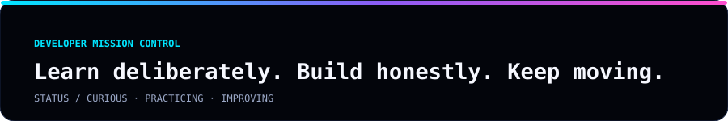

## DEVELOPER PROFILE

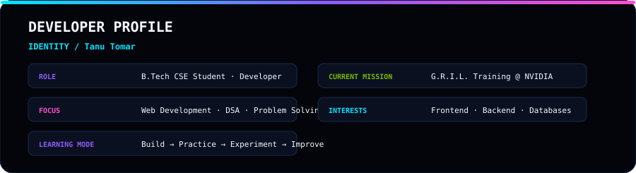

## CURRENT MISSION // 2026

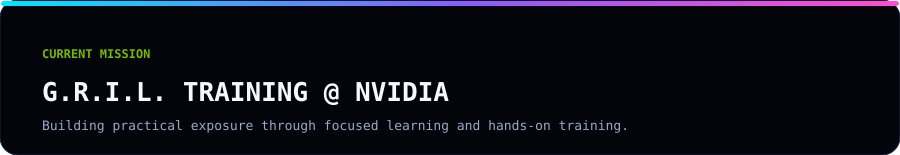

## SKILL CLOCK

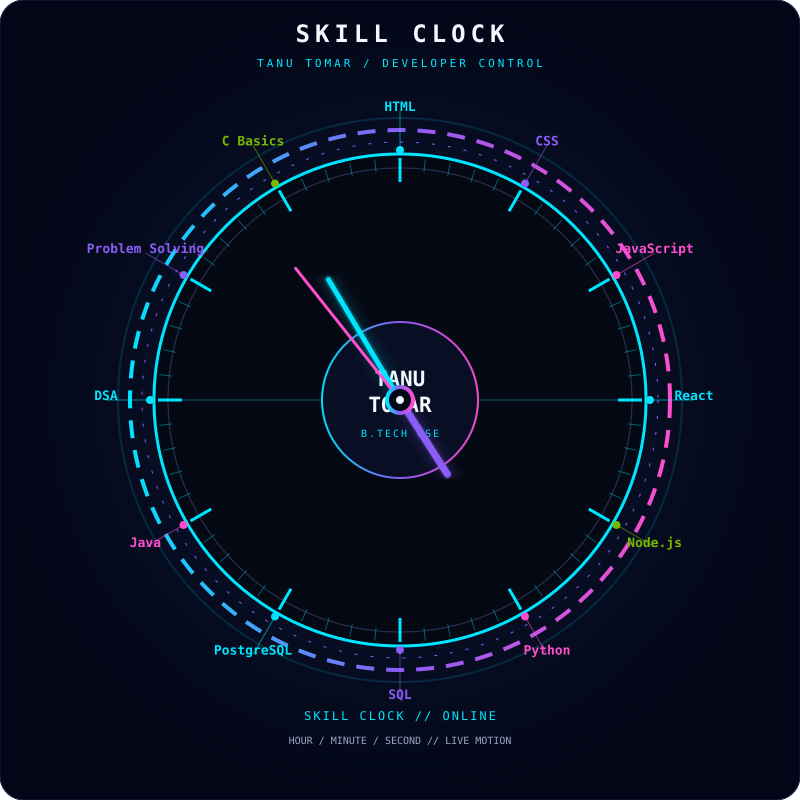

## SKILL CONSTELLATION

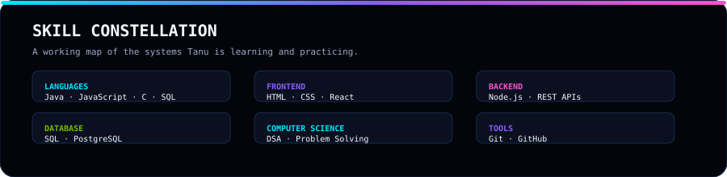

## TECHNOLOGY UNIVERSE

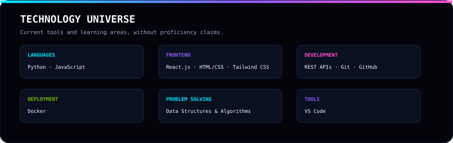

## LEARNING TRAJECTORY

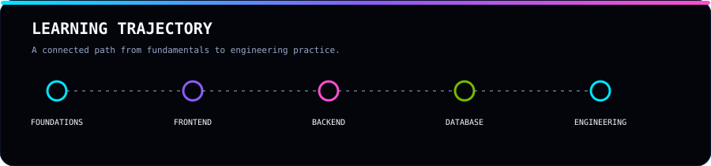

## CURRENT LEARNING // ACTIVE

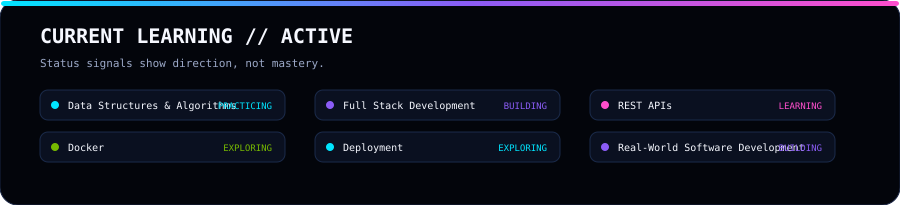

## DEVELOPER SIGNAL

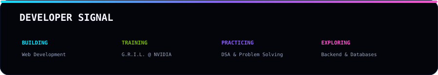

## GITHUB TELEMETRY

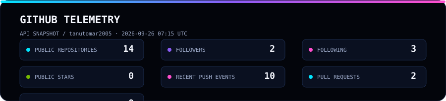

## CONTRIBUTION UNIVERSE

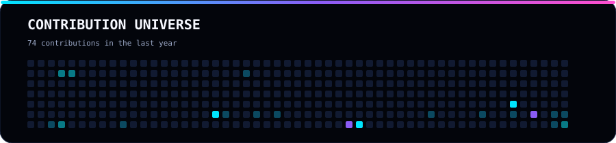

## GITHUB ACTIVITY

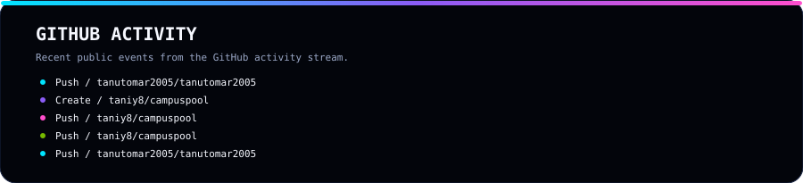

## REPOSITORY RADAR

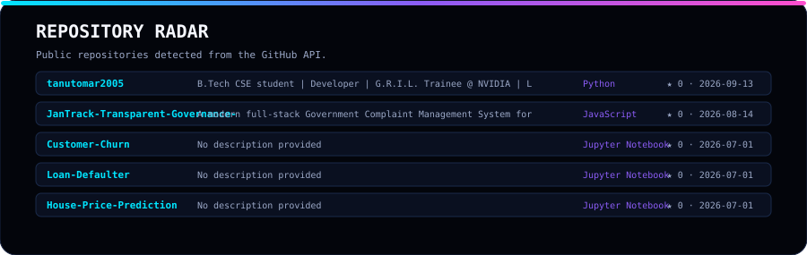

## LANGUAGE TELEMETRY

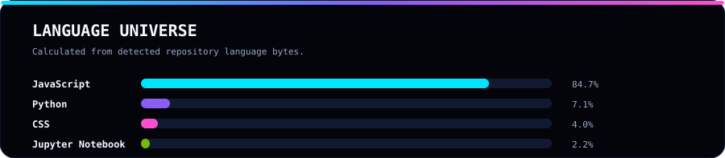

## DEVELOPER MINDSET

> Learn with curiosity. Build with care. Debug with patience. Keep improving.

## GITHUB / CONNECT

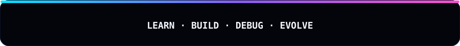

